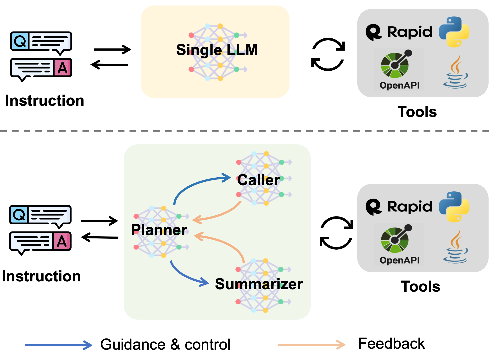
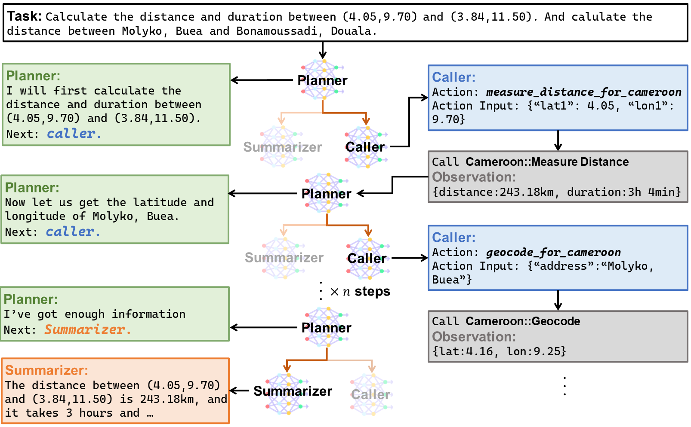
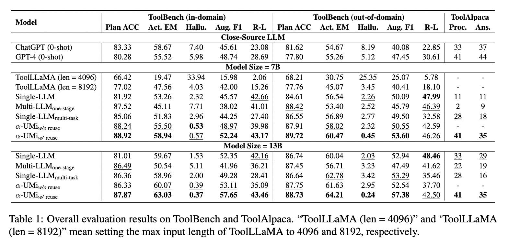
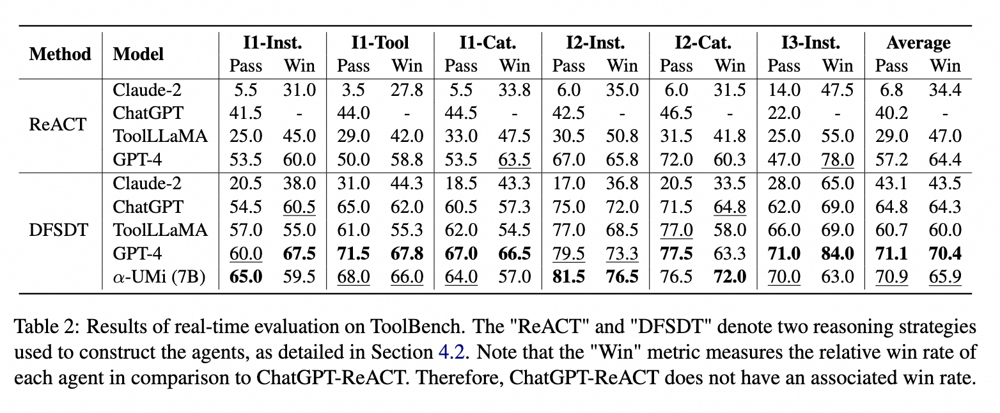

# ✨α-UMi: 多模型协作工具调用agent框架
<div align="center">
Weizhou Shen<sup>1</sup>, Chenliang Li<sup>2</sup>, Hongzhan Chen<sup>1</sup>, Ming Yan<sup>2*</sup>, Xiaojun Quan<sup>1*</sup>, Hehong Chen<sup>2</sup>, Ji Zhang<sup>2</sup>, Fei Huang<sup>2</sup>
</div>
<div align="center">
shenwzh3@mail2.sysu.edu.cn, quanxj3@mail.sysu.edu.cn, ym119608@alibaba-inc.com
</div>
<div align="center">
<sup>1</sup>中山大学 <sup>2</sup>阿里巴巴集团
</div>
<div align="center">
*Corresponding authors
</div>


<div align="center">
    <a href="https://github.com/modelscope/modelscope-agent/tree/alpha_umi"></a>
    <!-- <a href="https://replicate.com/joehoover/mplug-owl"></a>
    <a href="https://github.com/X-PLUG/mPLUG-Owl/blob/main/LICENSE"></a> -->
    <a href="https://arxiv.org/pdf/2401.07324.pdf"></a>
    <a href="https://hits.seeyoufarm.com"></a>
    <!-- <a href="https://twitter.com/xuhaiya2483846/status/1654640739010351106"></a> -->
</div>


<div align="center">
<a href="README.md">English</a> | <a href="README_zh.md">简体中文</a>
<hr>
</div>
<!--
English | [简体中文](README_zh.md)
<hr>
-->


<div align="center">




传统单LLM代理框架（上）与α-UMi（下）的概念对比。

</div>

α-UMi 是一个用于工具学习的多LLM协作智能体。它将单个LLM的能力分解为三个组件，即规划器（planner）、调用器（caller）和总结器（summarizer）。在智能体执行的每一步中，规划器根据系统的状态为当前步骤生成理由，并选择调用器或总结器来生成下游输出。调用器由理由指导，并负责调用特定的工具进行交互。总结器在规划器的指导下，根据执行轨迹制定最终的用户答案。


<div align="center">
 

一个展示α-UMi如何完成任务的插图。
</div>

## 亮点
* 使小型LLMs能够协作，并在工具学习中超越性能强大的闭源大型语言模型。
* 比单LLM智能体系统更灵活的提示设计。
* 两阶段的全局到局部渐进式微调（GLPFT）用于成功训练多模型协作智能体。


## 更新
* [01.30] 我们发布了✨α-UMi的代码，以及它的模型参数。


## 模型参数

| Model | 7b | 13b |
|-------|----|----|
| planner | [huggingface](https://huggingface.co/shenwzh3/alpha-umi-planner-7b)  / [modelscope](https://www.modelscope.cn/models/iic/alpha-umi-planner-7b) | [huggingface](https://huggingface.co/shenwzh3/alpha-umi-planner-13b)  / [modelscope](https://www.modelscope.cn/models/iic/alpha-umi-planner-13b) |
| caller | [huggingface](https://huggingface.co/shenwzh3/alpha-umi-caller-7b)  / [modelscope](https://www.modelscope.cn/models/iic/alpha-umi-caller-7b) | [huggingface](https://huggingface.co/shenwzh3/alpha-umi-caller-13b)  / [modelscope](https://www.modelscope.cn/models/iic/alpha-umi-caller-13b) |
| summarizer | [huggingface](https://huggingface.co/shenwzh3/alpha-umi-summarizer-7b)  / [modelscope](https://www.modelscope.cn/models/iic/alpha-umi-summarizer-7b) | [huggingface](https://huggingface.co/shenwzh3/alpha-umi-summarizer-13b)  / [modelscope](https://www.modelscope.cn/models/iic/alpha-umi-summarizer-13b) |


## 使用
### Install Requirements
1. 创建conda环境
```bash
conda create -n multi_llm_agent python=3.10
conda activate multi_llm_agent
```

2. 安装PyTorch

```
pip install torch==2.0.1 torchvision==0.15.2 torchaudio==2.0.2
```

3. 安装其他环境依赖
```bash
pip install -r requirements.txt
```

### 数据准备

#### ToolBench
1. 首先从 [Google Drive](https://drive.google.com/drive/folders/1yBUQ732mPu-KclJnuQELEhtKakdXFc3J) 或 [Tsinghua Cloud](https://cloud.tsinghua.edu.cn/f/c9e50625743b40bfbe10/)下载ToolBench的原始数据集，并把数据放到 ```./data``` 路径下.

2. 训练数据预处理
```
cd ./GLPFT

ORI_DATA_DIR="../data/toolbench/data" # your data path to save the toolbench raw data
RAW_DATA_OUT_DIR="dataset/toolbench/train/raw_data"
TRAIN_DATA_OUT_DIR="dataset/toolbench/train"
export PYTHONPATH=./


python process_data/toolbench/prepro_raw_stage_1.py \
 --data_dir $ORI_DATA_DIR \
 --output_path $RAW_DATA_OUT_DIR


python process_data/toolbench/prepro_raw_stage_2.py \
 --input_path $RAW_DATA_OUT_DIR/raw_data_stage_1.json \
 --output_path $RAW_DATA_OUT_DIR


for MODE in 'backbone' 'planner' 'caller' 'summarizer'
do
    python process_data/toolbench/prepro_$MODE.py \
        --input_path $RAW_DATA_OUT_DIR/raw_data_stage_2.json \
        --output_path $TRAIN_DATA_OUT_DIR/train_$MODE.json \
        --prompt_type toolbench_$MODE
done
```

在运行上述脚本后，您将创建用于GLPFT的ToolBench训练数据，这些数据将被存储在```./GLPFT/dataset/toolbench/train```中。

### GLPFT训练

我们的α-UMi采用了两阶段的GLPFT微调方法，首先对主干大型语言模型（LLM）进行预热，然后分别对planner、caller、summarizer进行微调。
1. 首先，我们对一个LLM底座进行微调，使其学习整个工具调用智能体任务。
```
cd ./GLPFT

LLAMA_PATH="" # your path for initial LLM checkpoint
NNODE=8
PORT=12345
BSZ=6
GA=1

EXP_NAME=/toolbench/backbone  # path to save model
export PYTHONPATH=./
torchrun --nproc_per_node=$NNODE --master_port=$PORT train_mem.py \
    --model_name_or_path $LLAMA_PATH  \
    --data_path dataset/toolbench/train/train_backbone.json\
    --output_dir saved_models/$EXP_NAME \
    --num_train_epochs 2 \
    --per_device_train_batch_size $BSZ \
    --per_device_eval_batch_size $BSZ \
    --gradient_accumulation_steps $GA \
    --evaluation_strategy "no" \
    --eval_steps 0 \
    --save_strategy "steps" \
    --save_steps 500 \
    --save_total_limit 8 \
    --learning_rate 5e-5 \
    --warmup_ratio 0.4 \
    --lr_scheduler_type "cosine" \
    --gradient_checkpointing True \
    --deepspeed ds_configs/stage3-a100.json \
    --bf16 \
    --logging_steps 2 \
    --model_max_length 4096 \
    --report_to none \
    --lazy_preprocess True 

```


2. 在获得了backbone模型后，我们开始基于这个模型对planner、caller和summarizer进行微调：


```
cd ./GLPFT

NNODE=8
PORT=12345
BSZ=6
GA=1


BB_PATH="saved_models/toolbench/backbone"


EXP_NAME=/toolbench/planner
export PYTHONPATH=./
torchrun --nproc_per_node=$NNODE --master_port=$PORT train_mem.py \
    --model_name_or_path $BB_PATH  \
    --data_path dataset/toolbench/train/train_planner.json \
    --output_dir saved_models/$EXP_NAME \
    --num_train_epochs 1 \
    --per_device_train_batch_size $BSZ \
    --per_device_eval_batch_size $BSZ \
    --gradient_accumulation_steps $GA \
    --evaluation_strategy "no" \
    --eval_steps 0 \
    --save_strategy "steps" \
    --save_steps 500 \
    --save_total_limit 8 \
    --learning_rate 1e-5 \
    --weight_decay 0.01 \
    --warmup_ratio 0.2 \
    --lr_scheduler_type "cosine" \
    --gradient_checkpointing True \
    --bf16 \
    --logging_steps 2 \
    --model_max_length 4096 \
    --report_to none \
    --lazy_preprocess True


EXP_NAME=/toolbench/caller
export PYTHONPATH=./
torchrun --nproc_per_node=$NNODE --master_port=$PORT train_mem.py \
    --model_name_or_path $BB_PATH  \
    --data_path dataset/toolbench/train/train_caller.json \
    --output_dir saved_models/$EXP_NAME \
    --num_train_epochs 1 \
    --per_device_train_batch_size $BSZ \
    --per_device_eval_batch_size $BSZ \
    --gradient_accumulation_steps $GA \
    --evaluation_strategy "no" \
    --eval_steps 0 \
    --save_strategy "steps" \
    --save_steps 500 \
    --save_total_limit 8 \
    --learning_rate 1e-5 \
    --weight_decay 0.01 \
    --warmup_ratio 0.2 \
    --lr_scheduler_type "cosine" \
    --gradient_checkpointing True \
    --bf16 \
    --logging_steps 2 \
    --model_max_length 4096 \
    --report_to none \
    --lazy_preprocess True


EXP_NAME=/toolbench/summarizer
export PYTHONPATH=./
torchrun --nproc_per_node=$NNODE --master_port=$PORT train_mem.py \
    --model_name_or_path $BB_PATH  \
    --data_path dataset/toolbench/train/train_summarizer.json \
    --output_dir saved_models/$EXP_NAME \
    --num_train_epochs 2 \
    --per_device_train_batch_size $BSZ \
    --per_device_eval_batch_size $BSZ \
    --gradient_accumulation_steps $GA \
    --evaluation_strategy "no" \
    --eval_steps 0 \
    --save_strategy "steps" \
    --save_steps 500 \
    --save_total_limit 8 \
    --learning_rate 1e-5 \
    --weight_decay 0.01 \
    --warmup_ratio 0.4 \
    --lr_scheduler_type "cosine" \
    --gradient_checkpointing True \
    --bf16 \
    --logging_steps 2 \
    --model_max_length 4096 \
    --report_to none \
    --lazy_preprocess True


```


### 推理和评估

我们为论文Section 4.1的实验提供了静态测试数据，存放在```./GLPFT/dataset/toolbench/test```目录下，我们可以通过运行以下脚本来进行 α-UMi 系统的推理和评估:：
```
cd ./GLPFT

NNODE=8
PORT=12345

PLAN_PATH="saved_models/planner"
CAL_PATH="saved_models/caller"
SUM_PATH="saved_models/summarizer"


LAB_DIR=output_res/toolbench
P_TYPE_PLAN=toolbench_planner
P_TYPE_CAL=toolbench_caller
P_TYPE_SUM=toolbench_summarizer


for DOMAIN in 'in_domain' 'out_of_domain'
do
    export PYTHONPATH=./
    torchrun --nproc_per_node=$NNODE --master_port=$PORT inference_utils/toolbench/infer_pipeline.py \
        --planner_model_name_or_path $PLAN_PATH  \
        --planner_use_lora False \
        --caller_model_name_or_path $CAL_PATH  \
        --caller_use_lora False \
        --summarizer_model_name_or_path $SUM_PATH  \
        --summarizer_use_lora False \
        --per_device_eval_batch_size 1 \
        --data_path dataset/toolbench/test/$DOMAIN.json \
        --bf16_full_eval \
        --assistant_prompt_type $P_TYPE_PLAN \
        --caller_prompt_type $P_TYPE_CAL \
        --conclusion_prompt_type $P_TYPE_SUM \
        --max_input_length 3750 \
        --output_dir $LAB_DIR/$DOMAIN 

    python inference_utils/toolbench/evaluate-multi_agent.py \
    --input_path $LAB_DIR/$DOMAIN/predictions.json \
    --output_path $LAB_DIR/$DOMAIN/metrics.json 

done
```

## α-UMi 与 RapidAPI 模拟器

我们支持像ToolBench团队([github](https://github.com/OpenBMB/ToolBench))一样使用真实的RapidAPI环境来运行我们的α-UMi，代码在 ```./ToolBench-multiLLM```目录下。在开始之前，你需要先填写[表格](https://forms.gle/oCHHc8DQzhGfiT9r6)来向ToolBench团队获取一个ToolBench Key. 之后你可以使用训练好的planner, caller和summarizer来运行一个RapidAPI模拟环境:

```
cd ToolBench-multiLLM

DATA_DIR="../data/toolbench/data"
PLAN_PATH="../GLPFT/saved_models/planner"
CAL_PATH="../GLPFT/saved_models/caller"
SUM_PATH="../GLPFT/saved_models/summarizer"
EXP_NAME="multi-llm-agent"
TBKEY="" # your toolbench key


for TEST_SET in 'G1_category' 'G1_instruction' 'G1_tool' 'G2_category' 'G2_instruction' 'G3_instruction'
do
    export PYTHONPATH=./
    python toolbench/inference/qa_pipeline.py \
        --backbone_model collab_agent_v3 \
        --tool_root_dir $DATA_DIR/toolenv/tools/ \
        --user_agent_collab True \
        --planner_model_path $PLAN_PATH \
        --planner_use_lora False \
        --caller_model_path $CAL_PATH \
        --caller_use_lora False \
        --summarizer_model_path $SUM_PATH \
        --summarizer_use_lora False \
        --use_multi_gpu True \
        --max_observation_length 1024 \
        --observ_compress_method truncate \
        --method DFS_woFilter_w2 \
        --input_query_file $DATA_DIR/test_instructions/$TEST_SET.json \
        --output_answer_file output_res/$EXP_NAME/$TEST_SET \
        --toolbench_key $TBKEY
done
```

我们也支持像ToolBench一样使用通过率（pass_rate）和胜率（win_rate）来评估系统.

评估通过率:
```
export PYTHONPATH=./
export ORI_ANSWER_PATH=output_res/multi-llm-agent
export CONVERTED_ANSWER_PATH=output_res/converted/multi-llm-agent

mkdir ${CONVERTED_ANSWER_PATH}
for test_set in "G1_instruction" "G1_category" "G1_tool" "G2_category" "G2_instruction" "G3_instruction"
do
    answer_dir=$ORI_ANSWER_PATH/$test_set
    output_file=${CONVERTED_ANSWER_PATH}/${test_set}.json
    python toolbench/tooleval/convert_to_answer_format.py\
        --answer_dir ${answer_dir} \
        --method DFS_woFilter_w2 \
        --output ${output_file}
done


export SAVE_PATH=pass_rate_results/multi-llm-agent
export CANDIDATE_MODEL=multi-llm-agent
export DATA_DIR="data/toolbench"
export API_POOL_FILE=path/to/your/openai_key_json_file.json
export PYTHONPATH=./
python toolbench/tooleval/eval_pass_rate.py \
    --converted_answer_path ${CONVERTED_ANSWER_PATH} \
    --save_path ${SAVE_PATH} \
    --reference_model ${CANDIDATE_MODEL} \
    --test_ids $DATA_DIR/test_query_ids \
    --max_eval_threads 1 \
    --evaluate_times 7
```


在评估胜率时，我们使用ToolBench团队发布的chatgpt_cot来作为标准对比模型，我们需要先计算chatgpt_cot的通过率:

```
# to evaluate win rate, we need to first convert the chatgpt_cot results and compute its pass rate

export REF_ANSWER_PATH=data/toolbench/reproduction_data/model_predictions/chatgpt_cot
export REF_CONVERTED_ANSWER_PATH=data/toolbench/reproduction_data/model_predictions_converted/chatgpt_cot
for test_set in "G1_instruction" "G1_category" "G1_tool" "G2_category" "G2_instruction" "G3_instruction"
do
    answer_dir=$ORI_ANSWER_PATH/$test_set
    output_file=${CONVERTED_ANSWER_PATH}/${test_set}.json
    python toolbench/tooleval/convert_to_answer_format.py\
        --answer_dir ${answer_dir} \
        --method DFS_woFilter_w2 \
        --output ${output_file}
done

export SAVE_PATH=pass_rate_results/chatgpt_cot
export CANDIDATE_MODEL=chatgpt_cot
export DATA_DIR="data/toolbench/data"
export API_POOL_FILE=path/to/your/openai_key_json_file.json
export PYTHONPATH=./
python toolbench/tooleval/eval_pass_rate.py \
    --converted_answer_path ${CONVERTED_ANSWER_PATH} \
    --save_path ${SAVE_PATH} \
    --reference_model ${CANDIDATE_MODEL} \
    --test_ids $DATA_DIR/test_query_ids \
    --max_eval_threads 1 \
    --evaluate_times 7
```

然后我们开始评估胜率：
```
export OUTPUT_CONVERTED_ANSWER_PATH=output_res/converted/multi-llm-agent
export SAVE_PATH=win_rate_results
export REF_PASS_TARE_PATH=pass_rate_results/chatgpt_cot
export OUTPUT_PASS_TARE_PATH=pass_rate_results/v9/multi-llm-agent
export REFERENCE_MODEL=chatgpt_cot
export CANDIDATE_MODEL=multi-llm-agent
# export API_POOL_FILE=path/to/your/openai_key_json_file.json


export PYTHONPATH=./
python toolbench/tooleval/eval_preference.py \
    --ref_converted_answer_path ${REF_CONVERTED_ANSWER_PATH} \
    --output_converted_answer_path ${OUTPUT_CONVERTED_ANSWER_PATH} \
    --reference_model ${REFERENCE_MODEL} \
    --output_model ${CANDIDATE_MODEL} \
    --test_ids data/test_query_ids/ \
    --save_path ${SAVE_PATH} \
    --ref_pass_rate_result_path ${REF_PASS_TARE_PATH} \
    --output_pass_rate_result_path ${OUTPUT_PASS_TARE_PATH} \
    --max_eval_threads 1 \
    --use_pass_rate true \
    --evaluate_times 7
```

## 实验结果

静态评估实验结果 (与标注的逐步比较)

<div align="center">
 
</div>

真实评估结果 (调用真实api完成用户任务)

<div align="center">
 
</div>

## To do

- [ ] 发布我们用于ToolAlpaca的模型和代码.
- [ ] 发布我们用于 MATH和GSM8K的模型和代码，以及我们的训练数据 (使用TORA (Gou et al., 2023)样式收集)
- [ ] 使α-UMi泛化到更多的智能体任务。

## 引用

```
@misc{shen2024small,
      title={Small LLMs Are Weak Tool Learners: A Multi-LLM Agent}, 
      author={Weizhou Shen and Chenliang Li and Hongzhan Chen and Ming Yan and Xiaojun Quan and Hehong Chen and Ji Zhang and Fei Huang},
      year={2024},
      eprint={2401.07324},
      archivePrefix={arXiv},
      primaryClass={cs.AI}
}
```